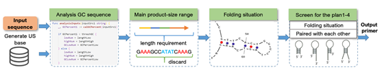
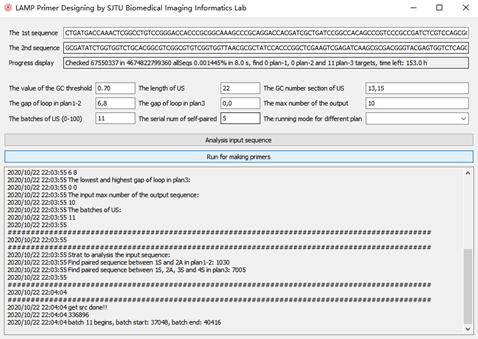

## About this program 

Loop-mediated isothermal amplification (LAMP) is a DNA amplification technology performed under isothermal conditions with high specificity, efficiency, and speed [Notomi T, Okayama H, Masubuchi H, Yonekawa T, Watanabe K, Amino N, Hase T: Loop-mediated isothermal amplification of DNA. Nucleic Acids Research 2000, 28:E63-e63, 28(12)]. In this work, we developed an extensible program, which is designed as a flexible tool for LAMP primer design, and it can meet various design requirements in a high-throughput informatics environment. Considering the characteristics of Golang, such as high running efficiency, native high concurrency and powerful fault-tolerant mechanism, our program is completely implemented in Golang to achieve high throughput analysis based on multithreading. Besides, Golang can be deployed on each major operating system (Windows, Linux, Mac), so this program can be easily switched between different platforms.



## How to use

### Environmental configuration

First you need to install the core code base [```RNAstructure6.1_command_line```](http://rna.urmc.rochester.edu/RNAstructure.html) 

For windows, in the program we specify the location is the root directory of the D drive, copy the compressed file to the root directory of the D drive and then extract it.

For MacOS or Linux, you can modify the path according to your needs.

Then you need to configure the environment variables. For windows, create a new DATAPATH in the system variable, the content is ```D:\RNAstructure6.1_command_line\data_tables```.  

```go build -ldflags="-H windowsgui"``` for making exe file.

### About GUI framework

This program uses [walk](https://github.com/lxn/walk/) as a GUI framework, you need to install the library according to the developer's instructions.

### Running program

Due to the large number of read and write operations, it is recommended that the program be run on a **mechanical hard disk** and ensure that at least 20G of space remains on the hard disk.

We need to enter a detection sequence before running, and the default value is already written in the code. Spaces are used as spaces between sequences, followed by thresholds and batches using commas as intervals. The input format is as shown below.

The interface of the program is shown in following figure, where the parameters entered are the default values of the program preset. The parameters represented by the input box in the program indicate respectively:

*   The 1st sequence: Used to input the first target sequence；
*   The 2nd sequence: Used to input the second target sequence；
*   Progress display: Used to show program run-time progress；
*   The value of the GC threshold: Used to define the threshold for judging whether the target sequence is rich in GC bases；
*   The input length of US: Used to define the length of the randomly generated US sequence；
*   The GC number section of US: Used to define the content of GC bases in US；
*   The gap of loop in plan1-2: Used to define the minimum distance between paired bases in complementary paired sequences；
*   The max number of the output: Used to define the number of final primers to be exported. When the exported primers reach this threshold, the program will automatically exit；
*   The batches of US: Used to define the thread for screening the US sequence；
*   The serial num of self-paired: Used to define the maximum length of consecutive paired bases in the final output primer；
*   The running mode for different plan: Used to select running ing mode, mode one corresponds to scheme 123, mode two corresponds to scheme 4；




Before starts, input the value of each parameter according to different requirements, and set the operating mode. Then click the *Analysis input sequence* button to start a continuous segmentation analysis of the target sequence to find potential primer fragments. After analyzing the target sequence, click *Run for making primers* to start screening the combinations of different sequences. The result will be displayed in the log box.